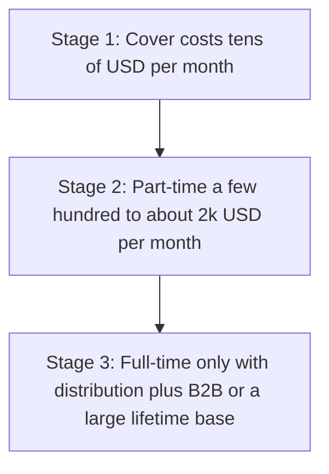

# Earn from Custos without subscriptions

Custos is a **privacy-first E2EE** ledger (wallet login, ciphertext in MongoDB, Malaysia-oriented calculator). That rules out the usual “free app funded by selling spend data” model. You also already tell users the official host is **free with full features** and that opting out of sharing does not cut features ([DataPrivacyModal](src/frontend/auth/components/DataPrivacyModal.tsx), [LegalModals](src/frontend/auth/components/LegalModals.tsx)). Monetization has to respect that, or you must change the legal copy **before** paywalling anything.

**Hard no:** subscriptions, targeted ads from ledger contents, or “partners” who get decrypted amounts/notes/addresses.

**You said yes to:** tips, one-time purchase, non-targeted ads, affiliates, B2B. You did **not** pick content as a primary channel, so this plan does not depend on YouTube/newsletter (it is only a later optional amplifier).

## Honest income ladder

Do not treat these as three products. They are **three revenue levels of the same mix**. Ads + tips alone will not replace a salary on a niche E2EE app.

| Stage         | Realistic mix                                                                                                                             | What “success” looks like                                           |
| ------------- | ----------------------------------------------------------------------------------------------------------------------------------------- | ------------------------------------------------------------------- |
| 1 — Survive   | Tips + Ethical/house ads on the **marketing site** + 1–2 affiliates                                                                       | MongoDB / Vercel / Resend / domain paid without you topping up      |
| 2 — Part-time | Add a **lifetime supporter** SKU + a small **Offers** surface + occasional contract/self-host                                             | Recurring-enough **one-time** sales and affiliate payouts to matter |
| 3 — Full-time | B2B (self-host license, white-label, workshops) **and** thousands of lifetime buyers or a distribution engine you did not want to own yet | Salary-like. Without that, stay at stage 2 on purpose               |

Ballpark hosted burn today (Hobby/free tiers, then paid): domain ~$15/yr; cron-job.org free; Resend free then usage; Vercel $0 then ~$20/mo; Atlas M0 then tens of USD/mo. Stage 1 is **keeping the stack on free/cheap tiers** and funding the first paid upgrade.

## What actually works with E2EE

The server cannot see category totals, titles, or amounts unless the **browser** uploads aggregates after opt-in. You already store a consent flag ([consent routes](src/api/routes/consent.ts)) and copy that promises “de-identified category totals” to research/ad partners — **nothing in the codebase sends those totals yet**. Tiny opt-in panels are also almost worthless to ad networks.

**Recommendation:** do **not** make “sell anonymized category totals” a revenue pillar. Either ship a real k-anonymous aggregate later (only if you have a large opted-in base) or rewrite that copy so you are not promising a pipeline you will not run. Brand damage from an E2EE app that “shares with advertising partners” is larger than the money.

Earn from **attention and trust**, not from the ciphertext.

## Revenue stack (no subscription)

### 1. Tips / donations (ship first — days)

Ko-fi, GitHub Sponsors, or similar. One **Support Custos** link: marketing site, Account menu, empty states (optional), README.

- Conversion is low (~1% of fans). Fine for **stage 1**.
- Frame it as “keep the official host free,” not guilt.

### 2. Lifetime supporter (the actual “freemium”)

One-time payment (e.g. **RM 49–99 / $12–25**). Not a subscription. Checkout via Lemon Squeezy / Polar / Stripe Payment Links — no in-app billing engine required at first (payment link + license email is enough).

**Keep the ledger free.** Gate **perks**, not core tracking, so you do not break today’s promise:

- Supporter badge in-app
- Extra accent / theme
- Higher reminder-email volume if Resend starts costing you
- Optional: +N wallets / vehicles as a soft cap (only after you rewrite “full features”)

Do **not** gate E2EE, export, or backups. That would punish the privacy users who are your brand.

Entitlement can be a signed flag on `users` after webhook, or even a manual “I paid” list until volume exists. YAGNI: Payment Link + you flipping a field is enough for the first 50 sales.

### 3. Ads that never see the ledger

- **Marketing site only** ([website/index.html](website/index.html)): EthicalAds, Carbon-style, or **house ads** (your own affiliates).
- In-app: at most one **non-personalized** slot on a non-ledger screen (e.g. Account → Support), never on Overview/Transactions. No AdSense next to encrypted numbers.
- Sponsorship: one Malaysian indie/privacy/fintech newsletter or podcast buy when you have a stable user count.

### 4. Affiliates (high intent, disclosed, off the ciphertext)

Custos already has a Malaysia-shaped calculator (EPF / SOCSO / PCB / SST). That is affiliate-adjacent **without reading the ledger**.

Put offers on a separate **Tools & offers** page (site and/or in-app), with a visible “we may earn a commission” line:

- Banks / debit / e-wallets (MAE, TnG, etc.)
- Brokers / EPF-related tools (only where the program is real and legal)
- Fuel / EV charge cards next to Vehicles
- Generic: privacy-respecting password managers, domains, VPS for self-host

**Never** auto-pick a product from someone’s categories. That is targeting, and you cannot do it honestly under E2EE anyway.

### 5. B2B (stage 2–3, not a landing-page fantasy)

This is the only lever that can approach full-time without a huge consumer funnel:

- **Paid self-host pack**: Docker compose + a few hours of setup email (price in hundreds of USD, not $9/mo).
- **Workshops / freelance**: “private ledger + SIWE + E2EE” for teams; you already have the repo.
- **White-label** only if someone asks (bank, NGO, campus). Do not build it speculatively.

## What not to build

- Subscriptions, trials, seat counts, usage meters in the API.
- Client upload of spend graphs “for partners” until you have a real buyer **and** a privacy design (k-anonymity, no re-ID).
- Paywalling Schedule, Insights, or encryption.

## Distribution (required for stage 2+)

You declined content-as-a-business. Then growth has to be **cheap and direct**: Product Hunt, Malaysian indie Discords, privacy forums, GitHub README + “Open the app,” university/club talks, and one-shot posts when you ship lifetime. Without _some_ discovery, lifetime SKUs and affiliates stay at coffee-money.

## Legal / ops (do these before money hits)

- Update Terms: official host remains free; lifetime is optional perks; ads/affiliates disclosed; consent copy matches reality.
- Malaysia: treat tips + lifetime + affiliate as **business income** (record it; SSM if it becomes regular).
- Resend/`EMAIL_FROM` must stay a **verified** sender (this already bit you). Do not burn deliverability on promo blasts.

## 90-day sequence

1. **Week 1–2:** Support link (Ko-fi/Sponsors) on site + Account. Rewrite or pause the “advertising partners / category totals” claim until it is true.
2. **Week 3–6:** Lifetime Payment Link + supporter perk (badge/theme). EthicalAds or house affiliate on the marketing site only.
3. **Week 7–12:** One **Offers** page with 2–3 real programs and disclosures. Write a one-page self-host / setup offer for inbound B2B.
4. **After that:** Revisit paywalls only if costs spike (email/DB). Revisit full-time only when lifetime + B2B has a visible run-rate — not when ads feel busy.

Skipped: in-app ad SDK, data-broker pipeline, subscription billing, content studio. Add those only if a stage 2 number is still missing after distribution exists.
